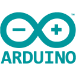
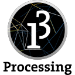

# Hello

I enjoy [programming](https://en.wikipedia.org/wiki/Computer_programming), [computer architecture](https://en.wikipedia.org/wiki/Computer_architecture), [shaders](https://en.wikipedia.org/wiki/Shader) and [math](https://en.wikipedia.org/wiki/Mathematics).

Most of my work has been in [Rust](https://www.rust-lang.org/), [C/C++](https://en.wikipedia.org/wiki/C%2B%2B), [Python](https://www.python.org/) and [various](https://www.khronos.org/opengl/wiki/Core_Language_(GLSL)) [shading](https://learn.microsoft.com/en-us/windows/win32/direct3dhlsl/dx-graphics-hlsl) [languages](https://gpuweb.github.io/gpuweb/wgsl/).

I have done [CPU](https://www.youtube.com/@erikbot42)/[digital logic](https://www.youtube.com/@erikbot42) in [Logic World](https://logicworld.net/) and [VCB](https://www.virtualcircuitboard.com/) and I like [the RISC-V ISA](https://riscv.org/).

Previously, I developed games in [Godot](https://godotengine.org/) and [Unity](https://unity.com/).

Fan of [FOSS](https://www.fsf.org/about/what-is-free-software) & [Linux](https://en.wikipedia.org/wiki/Linux).

My work can be found here and on [YouTube](https://www.youtube.com/@erikbot42)

<!--
**ErikBot42/ErikBot42** is a ✨ _special_ ✨ repository because its `README.md` (this file) appears on your GitHub profile.

Here are some ideas to get you started:

- 🔭 I’m currently working on ...
- 🌱 I’m currently learning ...
- 👯 I’m looking to collaborate on ...
- 🤔 I’m looking for help with ...
- 💬 Ask me about ...
- 📫 How to reach me: ...
- 😄 Pronouns: ...
- ⚡ Fun fact: ...
-->
# Some of my visual projects
## [discrete-logic-simulator](../../../discrete-logic-simulator)

## [RaymarchShader](../../../RaymarchShader)

## [rust-raytracing](../../../rust-raytracing)

